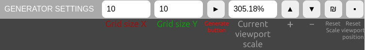
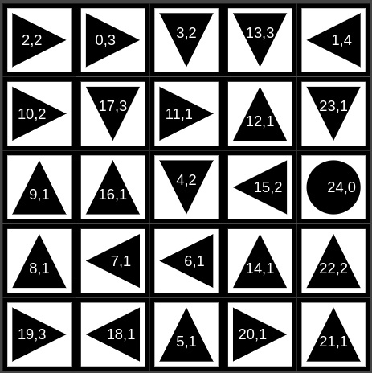

# transition-matrix-generator

## Idea
##### Note: Most of the text was translated via Yandex Translate
In the game "I hate this game" there was a task where it was necessary to turn the arrows in the right direction, they were fixed by themselves, but they had numbers on them that meant the number of transitions in the selected direction to another arrow.

For some crazy reason, I came up with the idea to make a generator of such a sequence, but I was faced with ignorance of algorithms in principle, so I needed a visual representation. Actually... this is one of the reasons why most of it was spent on developing a representation of this model.

## Interface

If the picture did not load, then here is the description from left to right:
- Number of cells on the X axis
- Number of cells on the Y axis
- Generate
- Current viewport scale
- Zoom in
- Zoom out
- Reset scale
- Reset viewport position

The viewport can be navigated by dragging with the left mouse button and zooming with the mouse wheel.

You can also turn the arrows clockwise and counterclockwise by pressing the left and right keys, respectively.

## Result example
**Caution**: creating a grid larger than 6x6 or 7x7 can go into deep bruteforce, as the algorithm tries to go through all possible paths!

